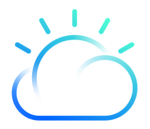

A set of labs to get started with the IBM Cloud Platform !

# List of Labs

+ [0 IBM Cloud Account](./labs/0%20IBM%20Cloud%20Account)

+ [1.0 Lab Cloud - Developer tools](./labs/1.0%20Lab%20Cloud%20-%20Developer%20tools)

+ [2.0 Lab Watson - Personality Insights & Tone Analyzer](./labs/2.0%20Lab%20Watson%20-%20Personality%20Insights%20&%20Tone%20Analyzer)

+ [2.1 Lab Watson - Watson Assistant](./labs/2.1%20Lab%20Watson%20-%20Watson%20Assistant)

+ [2.2 Lab Watson - Watson Visual Recognition](./labs/2.2%20Lab%20Watson%20-%20Watson%20Visual%20Recognition)

+ [3.0 Lab IoT - Simulator - Node-RED](./labs/3.0%20Lab%20IoT%20-%20Simulator%20-%20Node-RED)

+ [3.1 Lab IoT - Advanced](./labs/3.1%20Lab%20IoT%20-%20Advanced)

# Pre-Requisites

Make sure to have an [IBM Cloud Account](./labs/0%20IBM%20Cloud%20Account)
