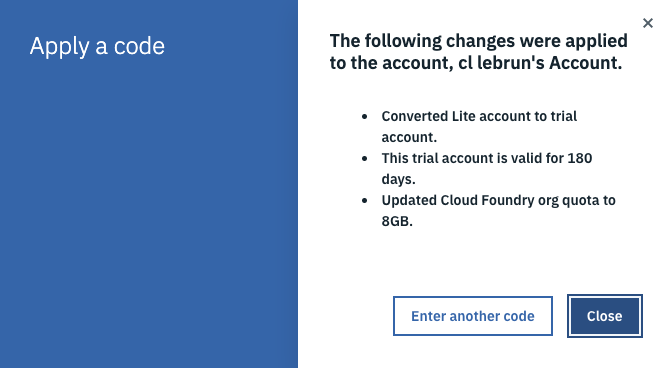

# Create an IBM Cloud account in the US region

+ Create an [IBM Cloud account](http://ibm.biz/masterclass_ibmcloud
) in the **US region**. You need an email address.

+ Look at your emails and confirm the registration

# Add a promocode to your IBM Cloud account

+ Convert your **Lite** account to a **Trial** account:

Once you applied your code, you get access to more resources on IBM Cloud!

Your Trial account is valid for about 6 months (depending on your code).

