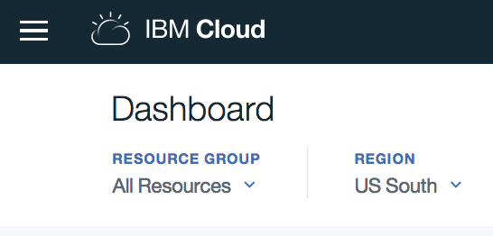
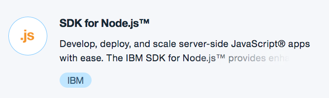
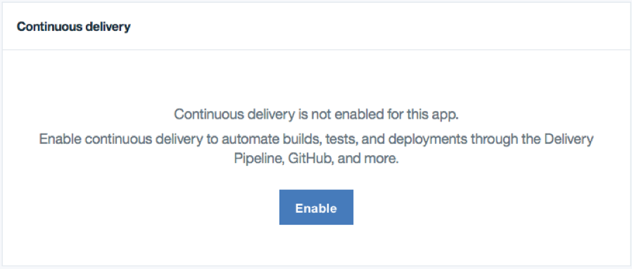
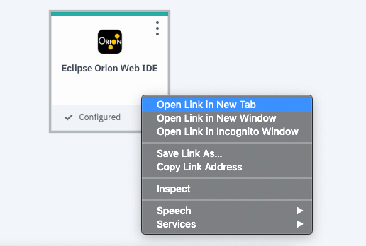
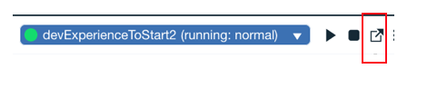
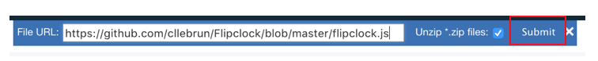

# 2.1 Lab Node.js - Developer tool: Toolchain - Introduction

In this lab, you’ll gain a high level understanding of the IBM Cloud Platform Toolchains


# Objective

In the following lab, you will learn:

+ How to setup a toolchains on the IBM Cloud Platform
+ How to use the online editor
+ How to deploy with the toolchain
+ How to use git with the toolchain
+ How to use the build and deploy


# Pre-Requisites

+ Get an [IBM Cloud Platform account](https://console.bluemix.net/registration/), or use an existing account.


# First Steps

1. Login to the IBM Cloud Platform: https://console.bluemix.net
2. Make sure to be loacated in the US-South region:


3. Select the Catalog tab (up and right).
4. Scroll down to the Cloud Foundry Apps section.
5. Select the "SDK for Node.js" runtime:


6. Give it a unique name.
7. Click "Create".
8. Wait for your application to start.
9. You have created an Hello Worls basic web app.
10. Click on "Visit App URL" to visualize your app.

# Add the development tools to your app

11. Back on the platform tab, on the Overview tab of your app, enable the “Continious Delivery“ option (back and left):


12. If it’s the first time you use the continuous delivery toolchain, it ask to create the toolchain. Make sure to be localized in the US-south region and click "Create".
13. Access the online editor "Eclipse Orion Web IDE":


# Part 1: simple update

14. You can now edit your source code. Open the index.html file in the public forlder
15. Change something in the text, for instances replace "Hello World" by "Hello <yourname>"
16. Save your app (ctrl+s or file->save)
17. Deploy:


18: Confirm if a popup shows up
19: When your app is started (green circle next to your app name), you can launch it to visualize the result:


# Part 2: complex update

In this part, you will use the Git tool to comit and push your updates. You will add a countdown to your application.

20: You need first to import two libraries to your code. A .css file for your clock's look and fill and a .js file for the javascript logic.
Select the "public" folder in your source code repository, click right and chose Import -> HTTP.
Import the two libraries, using these URL:

  ```
  https://raw.githubusercontent.com/cllebrun/Flipclock/master/flipclock.css

  https://raw.githubusercontent.com/cllebrun/Flipclock/master/flipclock.js

  ```

