# 1.0 Lab Cloud - Developer tools - Introduction

In this lab, you’ll gain a high level understanding of the IBM Cloud Platform integrated developer tools.


# Objective

In the following lab, you will learn:

+ How to setup a toolchain on the IBM Cloud Platform
+ How to use the online editor
+ How to use Git with the toolchain
+ How to Deploy with the toolchain
+ How to use the Delivery Pipeline

# Pre-Requisites

+ Get an [IBM Cloud Platform account](https://cllebrun.github.io/labs/0_Registration/), or use an existing account.

# Steps

1. Deploy your first app
2. Update the code using the Toolchain
3. Deployment Stages

# Step 1 - Deploy your first app

1. Login to IBM Cloud. https://cloud.ibm.com/login

2. Select the Catalog tab (up and right)

3. Scroll down to the **Compute** section.
4. Select the **"SDK for Node.js"** under the **Cloud Foundry** section:

  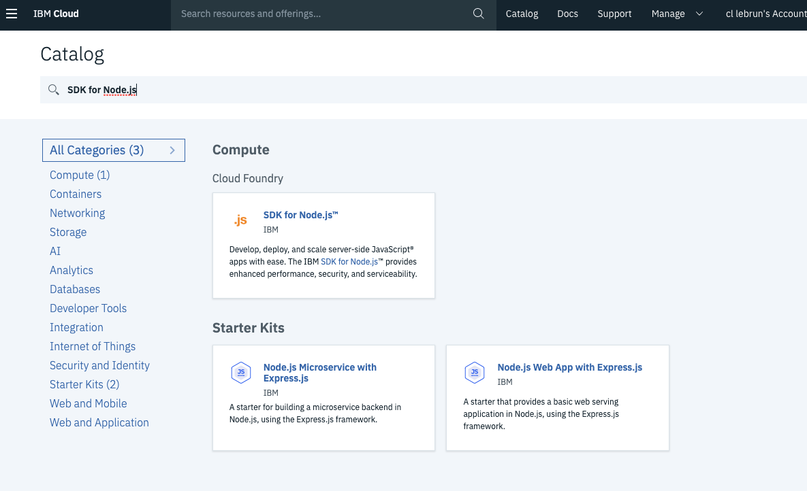

5. Give it a **unique name**, chose a region/location to deploy in (you need to have a space already created in this region). Select the default plan. Click **Create**.

  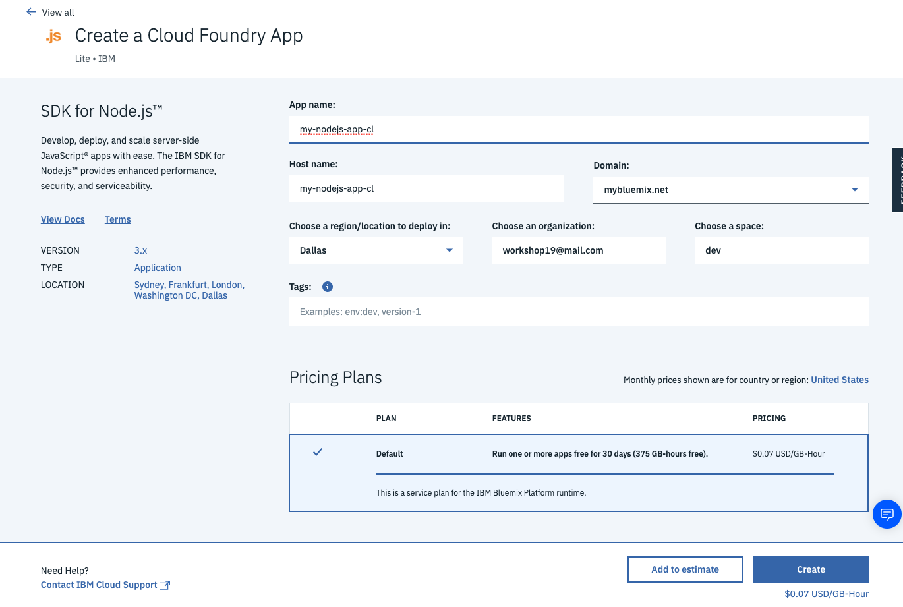

6. Wait for your application to start.

  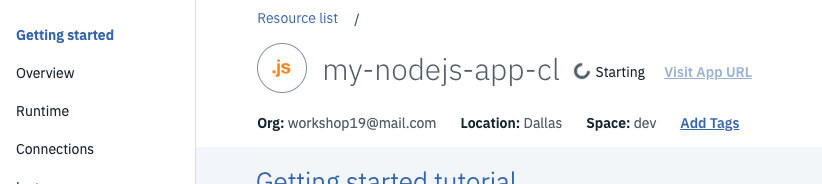

7. You have created an Hello World basic Node.js web app. Let's have a look at it:
Click on **"Visit App URL"** link to launch your app.

  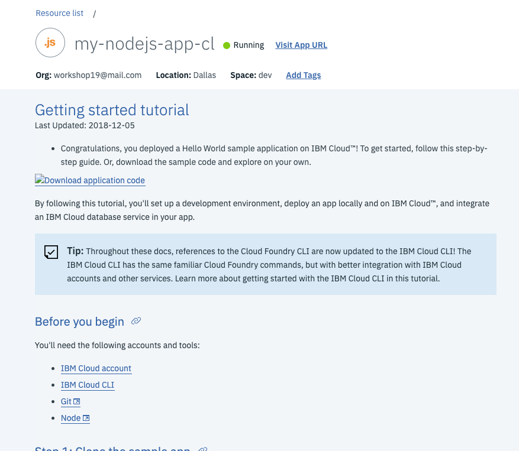

8. Congratulations! Your app is up and running!

  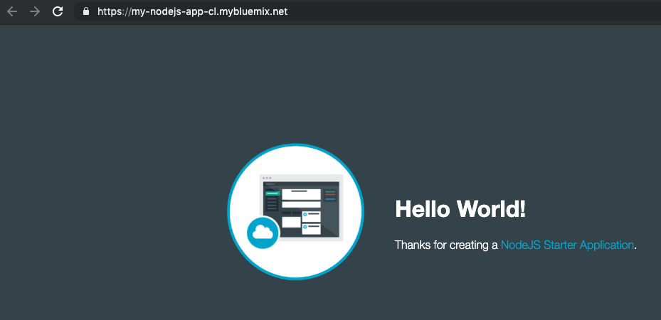

# Step 2 - Update the code using the Toolchain

To Develop and deploy on IBM cloud you have different choices.
- You can develop locally and push your code directly to IBM Cloud using the IBM Command Line Interface or pushing to a Git repository and deploy automatically to the IBM Cloud Platform.
- You can also develop directly on the IBM Cloud Platform using the online editor and pushing your code from there using the different integrated **Continuous Delivery** tools: the toolchain.

In this part, we will explore these developer tools integrated on the platform.
A toolchain is a set of tool integrations that support development, deployment, and operations tasks. The collective power of a toolchain is greater than the sum of its individual tool integrations.


9. In your browser, switch back on the IBM Cloud tab, click on the **Overview** tab of your app,

  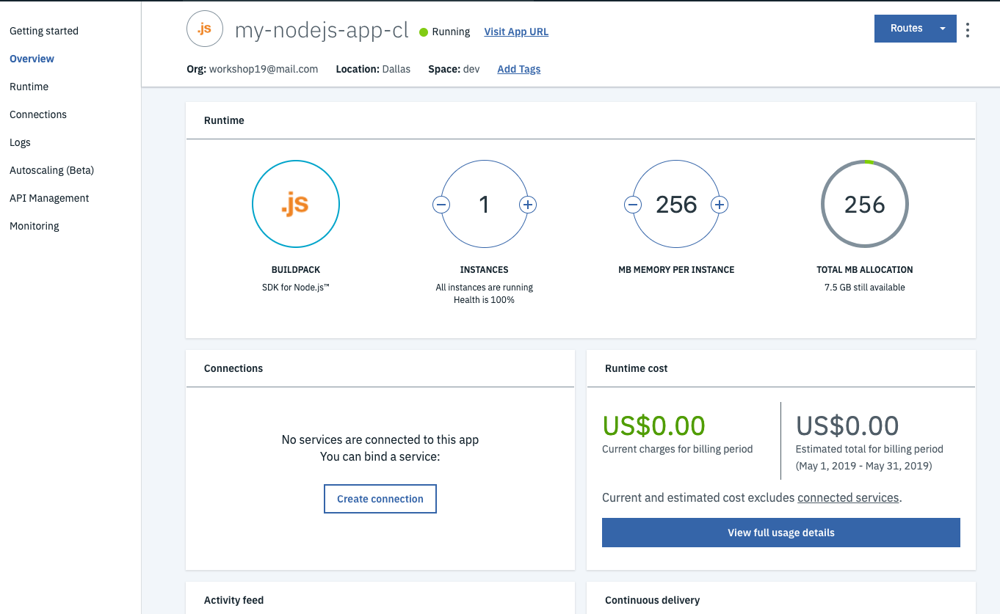

10. Scroll down to the **Continuous delivery** section and enable this option for your app:

    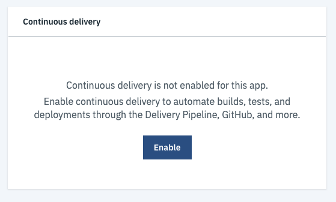

This will create for you a Continuous Delivery service in order to access **Git Repos**, **Issue Tracking**, **Eclipse Orion Web IDE** and **Delivery Pipeline** as default tools.

11. Leave the default options and make sure the region selected is the region where you have deployed your app. Click **Create**.

    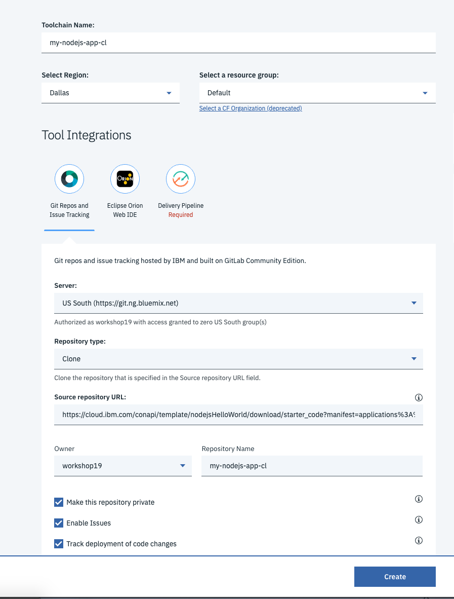

12. Create an **IBM Cloud API Key** as default.

    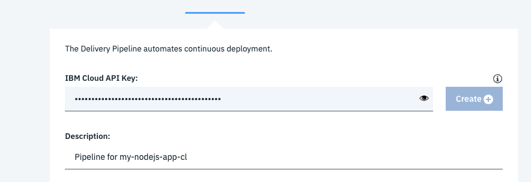

13. You have created your toolchain associated to your app with the default integrated tools:

    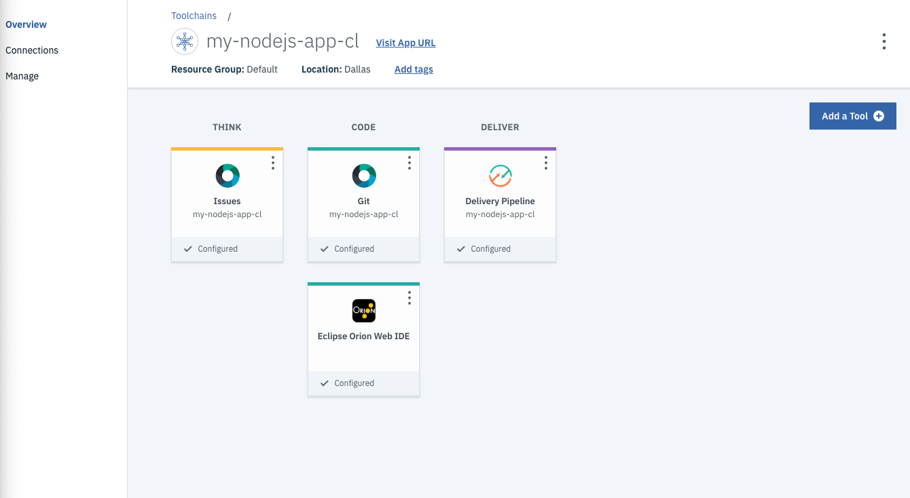

14. Let's check the different tools. Right click on the Git tool and select **"open link in a new tab"** to have a look:

  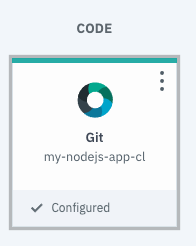

Note your repository has been cloned as a private IBM Cloud Project.

15. Check your files are here:

  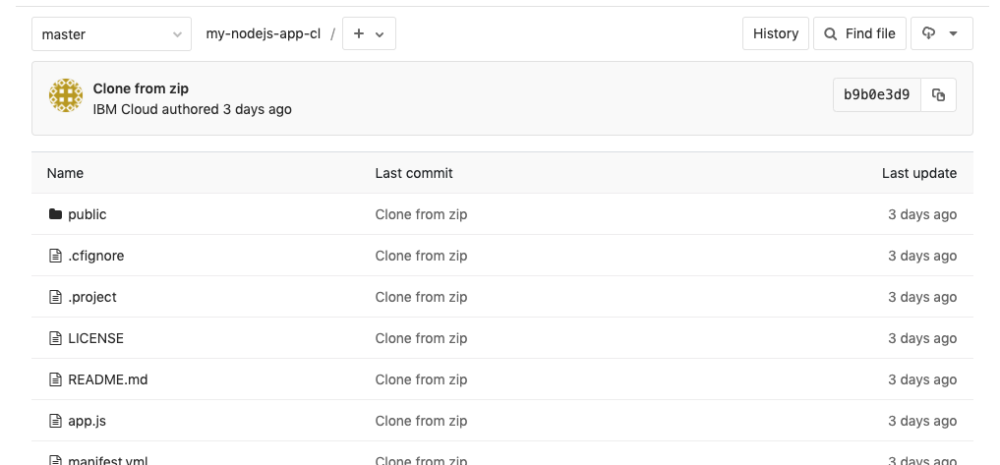

Note that you can give access to this project by adding Members (Members -> Invite Member).


16. Go back to your tools switching of tabs.

  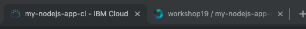

17. Open now the **Delivery Pipeline** in a new tab. (click right)

  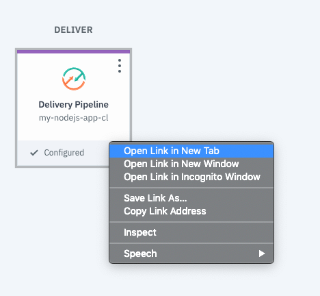

A delivery pipeline automates the continuous deployment of a project. In a project's pipeline, sequences of stages retrieve input and run jobs, such as builds, tests, and deployments.


> **_NOTE:_**     Hints and tips for using Delivery Pipeline
- Jobs run in discrete working directories in containers that are created for each pipeline run. Before a job is run, its working directory is populated with input that is defined at the stage level.
- The jobs in a stage can't pass artifacts to each other. However, stage environment properties can be used in all jobs.
- By default, stages run sequentially after changes are delivered to source control. If you do not want a stage to run whenever a change is delivered, you can disable the capability. On the INPUT tab, in the Stage Trigger section, click Run jobs only when this stage is run manually.
- Manifest files, which are named manifest.yml and stored in a project's root directory, control how your project is deployed to IBM Cloud.
- You can use environment properties and preinstalled resources in pipelines. For example, you might incorporate them into a job script or test command.

It created by default a delivery pipeline with two stages: build and deploy:

  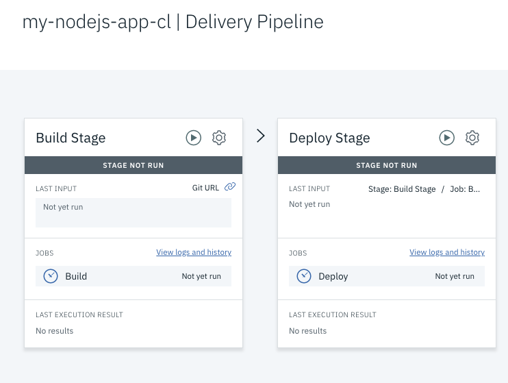

18. Go back to your tools switching of tabs.

  

19. Open now the **Eclipse Orion Web IDE** in a new tab. (click right)

  

> **_NOTE:_**  The Eclipse Orion Web IDE is a browser-based development environment where you can develop for the web in JavaScript, HTML, and CSS with the help of content assist, code completion, and error checking. The Web IDE works with nearly any language and you can highlight syntax for most file types. Source control is built in, and you can deploy code locally to test and debug your apps.
Best of all, the Web IDE is powered by the web. You have nothing to install, nothing to maintain, and nothing to scale. You can develop anywhere that you have an internet connection.

  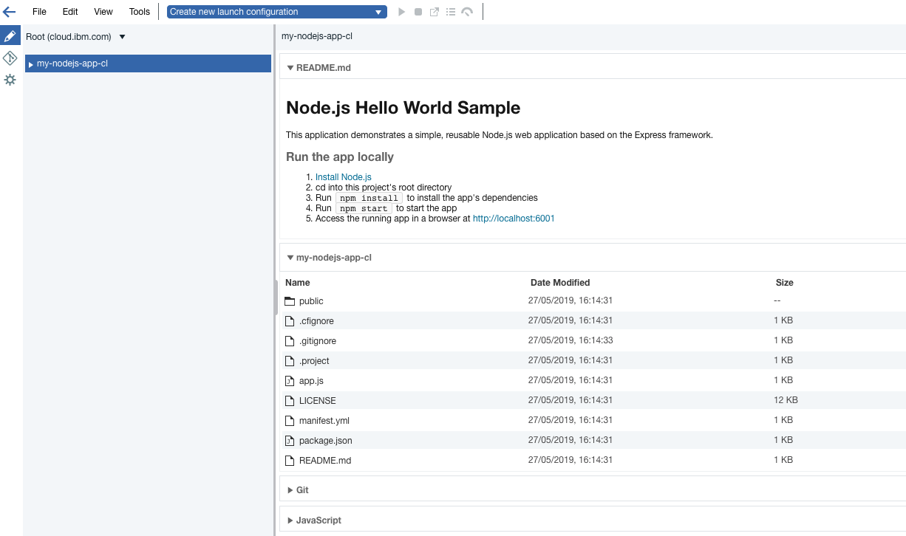

  When you open the Web IDE, it clones repos from the toolchain that it hasn't encountered before into your personal cloud workspace. After the cloning is finished, those repos are available for you to work with in the same way that you would work with a local clone on your desktop:

  When you edit in the Web IDE, your changes are saved to your cloud workspace.
  When you commit a change by using the integrated git tools in the Web IDE, the change is committed to the active branch in that repo in your workspace.
  When you push a commit, it is pushed from the repo in your workspace to the remote Git repo (the one in your toolchain).


20. Let's open the public/index.html file

  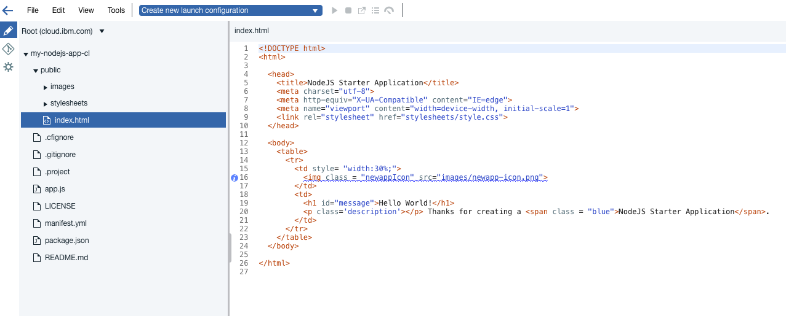

21. Let's change the code. Line 9, replace "World" by your own name:

```  
  <h1 id="message">Hello Clem!</h1>
```
22. Save!

  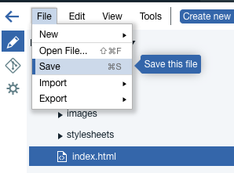

23. On the left tab, click on the Git icon.

  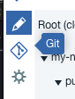

24. With this tool you can commit and push your changes to your Git repository.You can expand public/index.html to see the changes. The changes are highlighted: the original content is in red and the changed content is in green.

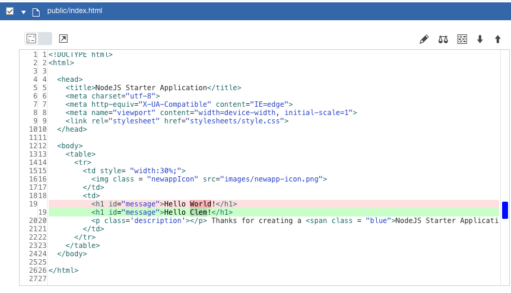

25. Let's add a **Commit message** and click **Commit**.

  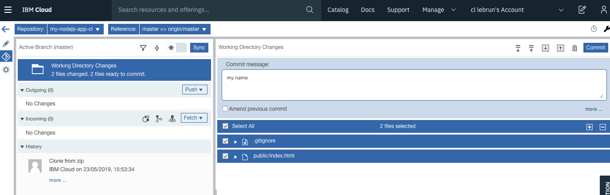

  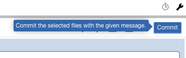

26. Let's push yout commit :

  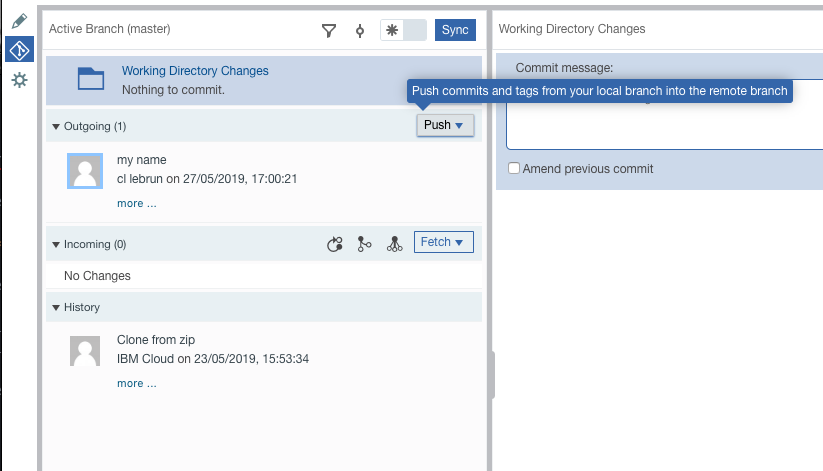

27. Switch to your **Delivery Pipeline** tab:
You may see your code beeing automatically built and deployed.

 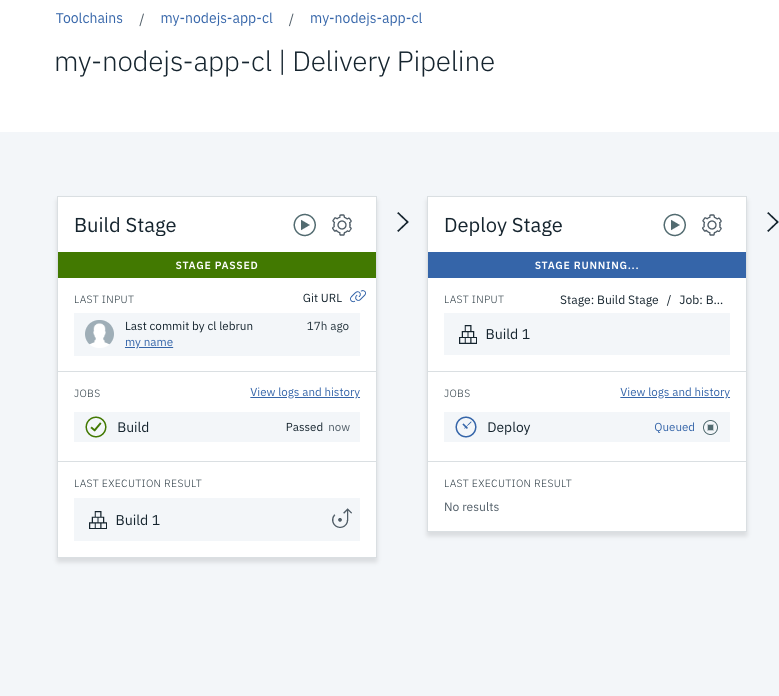

Note, the last input taken by the build stage is the last commit you have pushed to your Git repository.

28. When your app is deployed, you can refresh the tab where you opened your "Hello World" app at the beginning of the lab:

   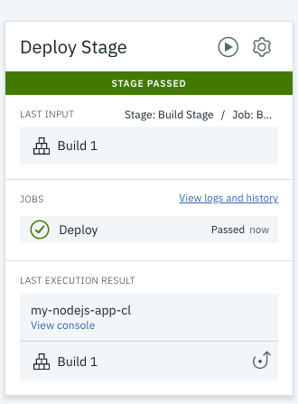


   Your change is now live !

   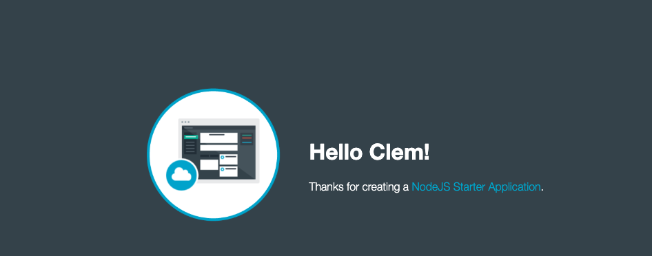


# Step 3 - Deployment Stages

In this part, you will add a new stage to the pipeline.

With a delivery pipeline, you can automate the continuous building, testing, and deployment of your apps.

The Build stage pulls the source code from your repository. It then runs jobs to compile or otherwise process the code to produce artifacts suitable for deployment. Each job runs in its own container. The artifacts are passed to follow-on stages through the build archive directory in the container. By default, this directory is the same as the directory where the source code was checked out. The Simple build job type passes the source code from your repo on as the result without modifying it.

The Deploy stage contains jobs that deploy the artifacts created by the Build stage. For Cloud Foundry apps, if a manifest file exists in the root folder, it is used to determine which buildpack to use.

29. Go back to your **Delivery Pipeline** tab.

The pipeline has two stages: one where your app is built and another where it is deployed. After the pipeline completes its deployment process, the pipeline dashboard shows that both stages completed successfully.

30. To add a third stage to deploy a test instance of your app, click **Add Stage**.

31. Click the stage name, "MyStage", and change the name to "Deploy Stage - Test".

   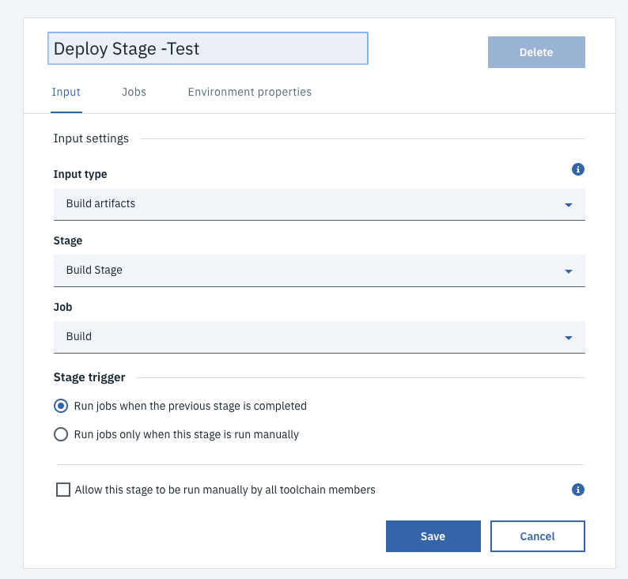

32. Click the **JOBS tab**.

33. Click **ADD JOB**, and then select the **Deploy job type**.

34. Review the **IBM Cloud region** to choose the region where your test application will be deployed.  Review the **Organization** and **Space** fields. Those values specify where in the region to deploy the test instance of the app.

35. In the **Deploy Script** field, change the "cf push" command to
```
cf push "${CF_APP}"-test -n "${CF_APP}"-test
```
This stage is configured to stop if the job fails.

This command deploys the app to the test server.


> **_NOTE:_**: For the new stage, the app name (as shown in the Application name field) has -test appended to it. That name is set by the push "${CF_APP}"-test command. Similarly, the deployed app will be running at a route that looks like {Application name}-test.mybluemix.net (with no curly brackets) because of the -n attribute that sets the host name.

   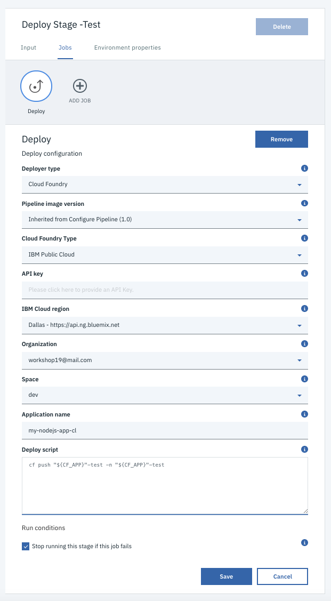

36. Click **Save**

37. Drag the stage that you just created so that it is between the first two stages.

   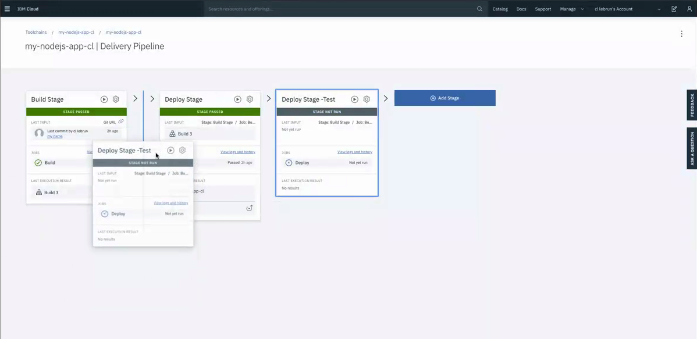

38. View the updated pipeline.

   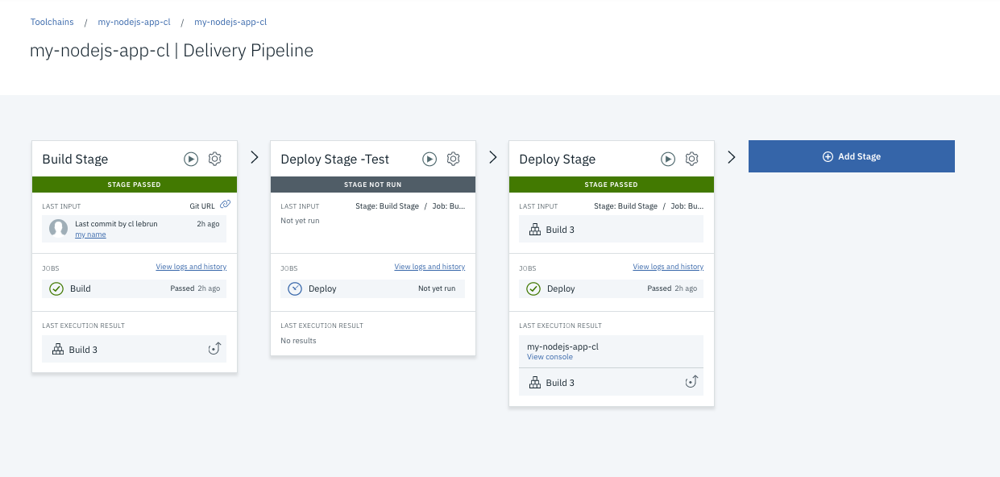

39. Click the Run Stage button in the new stage.

   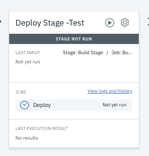

40. Review the pipeline after all three stages run.

   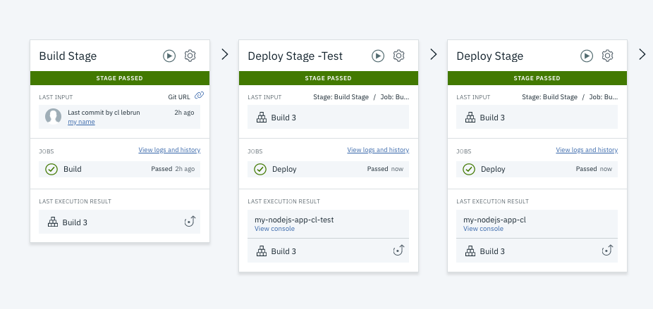

41. Launch the application to confirm the change to the URL.

   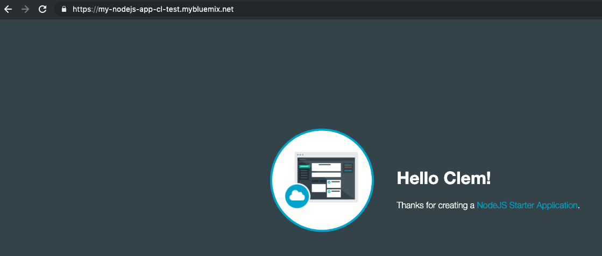


> **_NOTE:_** For more information about the delivery pipeline, see the Pipeline overview in the [IBM Cloud Docs]([IBM Cloud Docs](https://cloud.ibm.com/docs/services/ContinuousDelivery?topic=ContinuousDelivery-deliverypipeline_about#deliverypipeline_about&cm_mmc=IBMBluemixGarageMethod-_-MethodSite-_-10-19-15::12-31-18-_-pipeline-about-docs).
To learn about the practice of creating and using delivery pipelines, see [Automate continuous delivery through a delivery pipeline](https://www.ibm.com/cloud/garage/practices/deliver/practice_delivery_pipeline/).
