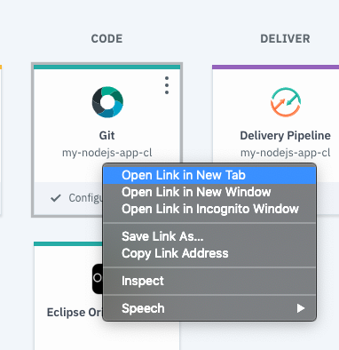

# 1.0 Lab Cloud - Developer tools - Introduction

In this lab, you’ll gain a high level understanding of the IBM Cloud Platform Toolchains


# Objective

In the following lab, you will learn:

+ How to setup a toolchains on the IBM Cloud Platform
+ How to use the online editor
+ How to deploy with the toolchain
+ How to use git with the toolchain
+ How to use the build and deploy


# Pre-Requisites

+ Get an [IBM Cloud Platform account](https://cllebrun.github.io/labs/0_Registration/), or use an existing account.

# Steps

1. Deploy your first app
2. Using the Toolchain
3. Service Integration

# Step 1 - Deploy your first app

1. Login to IBM Cloud. https://cloud.ibm.com/login

2. Select the Catalog tab (up and right)

3. Scroll down to the **Compute** section.
4. Select the **"SDK for Node.js"** under the **Cloud Foundry** section:

  

5. Give it a **unique name**, chose a region/location to deploy in (you need to have a space already created in this region). Select the default plan. Click **Create**.

  

6. Wait for your application to start.

  

7. You have created an Hello Worls basic Node.js web app. Let's have a look at it:
Click on **"Visit App URL"** link to launch your app.

  

8. Congratulation! Your app is up and running!

  

# Step 2 - Using the Toolchain

To Develop and deploy on IBM cloud you have different choices.
- You can develop locally and push your code directly to IBM Cloud using the IBM Command Line Interface or pushing to a Git repository and deploy automatically to the IBM Cloud Platform.
- You can also develop directly on the IBM Cloud Platform using the online editor and pushing your code from there using the different integrated **Continuous Delivery** tools: the toolchain.

In this part, we will explore these developer tools integrated on the platform.


9. Back on the platform tab, click on the **Overview** tab of your app,

  

10. Scroll down to the **Continuous delivery** section and enable this option for your app:

    

This will create for you a Continuous Delivery service in order to access **Git Repos**, **Issue Tracking**, **Eclipse Orion Web IDE** and **Delivery Pipeline** as default tools.

11. Leave the default options and make sure the region selected is the region where you have deployed your app. Click **Create**.

    

12. Create an **IBM Cloud API Key**

    

13. You have created your toolchain associated to your app with the default integrated tools:

    

14. Let's check the different tools. Click on the Git tool to have a look:

  

Note your repository has been cloned as an IBM Cloud Project.

12. If it’s the first time you use the continuous delivery toolchain, it ask to create the toolchain. Make sure to be localized in the US-south region and click "Create".
13. Access the online editor "Eclipse Orion Web IDE":


# Part 1: simple update

14. You can now edit your source code. Open the index.html file in the public forlder
15. Change something in the text, for instances replace "Hello World" by "Hello <yourname>"
16. Save your app (ctrl+s or file->save)
17. Deploy:


18: Confirm if a popup shows up
19: When your app is started (green circle next to your app name), you can launch it to visualize the result:


# Step 3 - Service Integration

In this part, you will use the Git tool to comit and push your updates. You will add a countdown to your application.

20: You need first to import two libraries to your code. A .css file for your clock's look and fill and a .js file for the javascript logic.
Select the "public" folder in your source code repository, click right and chose Import -> HTTP.
Import the two libraries, using these URL:

  ```
  https://raw.githubusercontent.com/cllebrun/Flipclock/master/flipclock.css

  https://raw.githubusercontent.com/cllebrun/Flipclock/master/flipclock.js

  ```

