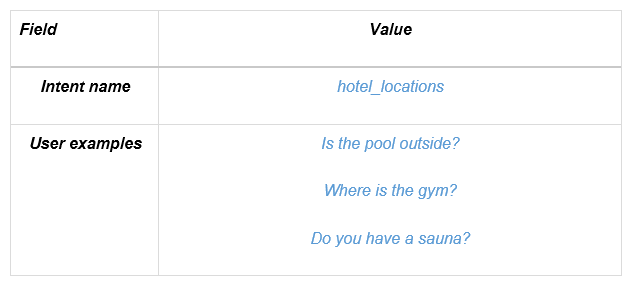
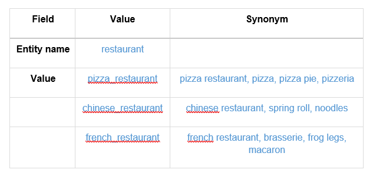

# 2.3 Lab Watson - Assistant

Overview
========

The [*IBM Watson Developer Cloud*](http://www.ibm.com/smarterplanet/us/en/ibmwatson/developercloud/) (WDC) offers a variety of services for developing cognitive
applications. Each Watson service provides a Representational State Transfer (REST) Application Programming Interface (API) for interacting with the service. Some services, such as the Speech to Text service, provide additional interfaces.

The [*Watson Assistant*](http://www.ibm.com/watson/developercloud/conversation.html) service combines several cognitive techniques to help you build and
train a bot - defining intents and entities and crafting dialog to simulate conversation. The system can then be further refined with supplementary technologies to make the system more human-like or to give it a higher chance of returning the right answer. Watson Assistant allows you to deploy a range of bots via many channels, from simple, narrowly focused bots to much more sophisticated, full-blown virtual
agents across mobile devices, messaging platforms like Slack, or even through a physical robot.

Objectives
==========

In this lab, you will:

-   Learn how to use the IBM Cloud web user interface to create and manage Watson services

-   Learn how to build and train your chatbot with the Watson Assistant tool

Prerequisites
=============

Create an IBM Cloud account: {#create-an-ibm-cloud-account .ListParagraph}
----------------------------

IBM Cloud is a platform-as-a-service (PaaS) that allows you to create your own application mashups using a variety of runtimes and services. The cognitive services offered by the IBM Watson Developer Cloud are
made available in IBM Cloud. So, before you can begin building cognitive applications, you will need to create your own IBM Cloud account.

1.  If you already have an IBM account, browse the URL and login:
    <https://cloud.ibm.com/login>

2.  If you don't, please browse <https://ibm.biz/cloud-4-dev> and register.

> **Please, select "United States" as Region:**
>
> {width="6.5in" height="0.8534722222222222in"}
>
> You will need to confirm your registration when receiving an email from the IBM Cloud team.

Getting started with IBM Watson Assistant
=========================================

**Use case**: A Hotel Concierge Virtual assistant that is accessed from the guest room and the hotel lobby.

**End-users**: Hotel customers

1.  Log in to IBM Cloud credentials. This should be your IBM ID.

2.  You should start on your dashboard that contains metrics related to your IBM Cloud activities.

3.  Click on the **Catalog** tab (up and right) to access the Catalog of resources you can consume on IBM Cloud:

{width="6.5in" height="0.6715277777777777in"}

4.  Select the **AI** category. This is the list of Watson APIs and other AI services you can access to. Select the **Watson Assistant** service.

{width="6.5in" height="4.283333333333333in"}

5.  A default name is given, you can change it if you like. Leave the Resource group as default, depending of your previous activitie with your IBM Cloud account you may have a different name as the
    selected resource group. Select the Dallas region if you have the choice, if not, leave it as default.

> Notice that the selected plan is the free Lite plan, it's enough to get you started and to complete this Lab.

 Click **Create**.

{width="6.5in" height="4.903472222222222in"}

 Note that you get an API Key and a URL for your service. With these credentials you can call your service from any web or mobile application. If you click on API reference, you get several examples
 on how to use the API.

 {width="6.5in" height="2.651388888888889in"}

Create your first Skill
=======================

To use the new Assistant, you will need to train it with the intents, entities, and/or dialog nodes relevant to your application's use case.
You will create these items in a Skill. A Skill is a container for the artefacts that define a piece of the behavior of your service instance.

1.  Click on the **Launch tool** button to open the Watson Assistant tooling:

{width="6.5in" height="2.8833333333333333in"}

2.  From the home page of the Watson Assistant tool, at the bottom,
    click **Create a Skill**.

{width="6.5in" height="3.0076388888888888in"}

3. Skill enables you to maintain separate intents, user examples, entities, and dialogs for each application. Click **Create new**.

4. Give it a name and chose **English** as language. Click **Create**.

{width="6.5in" height="4.572916666666667in"}

Intents
=======

In order to use the new conversation, you will need to train it with the
intents, entities, and/or dialog nodes relevant to your application's
use case. An intent is the purpose or goal of a user's input.

1.  First, you will need to define some intents to help control the flow of your dialog. An
    [intent](https://console.bluemix.net/docs/services/conversation/intents.html#defining-intents) is the purpose or goal of a user's input. In other words, Watson will use natural language processing to recognize the intent of the user's question / statement to help it select the
    corresponding dialog branch for your automated conversation.

    Click on **Add intent**.

    {width="6.5in"
    height="3.8402777777777777in"}

2. Enter `hotel_locations` as Intent name then click **Create intent**

    {width="6.263888888888889in"
    height="2.8513888888888888in"}

3. Enter the examples as defined below in the **Add user examples** field and click **Add example** button after each of them. The user examples are phrases that will help Watson recognize the new intent.

    

{width="3.832147856517935in"
height="4.154608486439195in"}

4.  When finished, click on the arrow Icon (top left side of the window) to go back to list of existing intents.

At this point, you have defined one intent for the application along with the example utterances that will help train Watson to recognize and control the conversation flow.

Intents can be imported into the Watson Assistant tool using a Comma Separated Values (CSV ) file saved with UTF-8 encoding. In order to import a file successfully, it must include only two columns: one for user examples and one for intents.

**Note**: This step has already been done for you

5.  Click Import

    {width="6.5in"
    height="1.4131944444444444in"}

    Drag `WA_intents.csv` into the **Choose a file** box or click **Choose a file** to browse your computer.

> **Note**: Notice that the conversation tooling did not import any questions that were exact duplicates of questions that you manually entered. Duplicates are not case sensitive. For example, "Do you have a sauna*?"* is the same as "do you have a sauna". It did import questions that had semantic differences, such as the absence of punctuation, extra spaces between words, or misspelled words.

So all existing utterances of hotel\_locations were ignored:

{width="4.713485345581803in"
height="2.5229166666666667in"}

Click **Done.** Let's now test your intents.

**Try it** panel is used for testing in the lab guide.

When WA is training on recently added data. You must wait for the message highlighted with purple to clear before you can test newly added intents, utterances, entities. Watson will respond, but you will get unpredictable results until the training is complete.

{width="2.9262992125984253in"
height="1.4313418635170603in"}\_{width="3.1051202974628174in"
height="1.4880500874890639in"}

6.  Open the **try it** panel by clicking on the following icon (upper right):

{width="6.5in" height="0.7611111111111111in"}

You cannot perform the **Try it out** activities in this section until Watson has finished training on your recent changes. When Watson is finished, the purple box with the text, "Watson is training" will no longer appear in your \"Try it out\" panel. You may also notice a message stating that, \"Watson has finished training!\".

7.  Type *`how do I get in the gym?`*

> **Note:** Notice that Watson assigns this question to the intent *\#hotel\_locations*.  The *#hotel\_locations* intent is meant for questions that refer to finding directions for locations within the hotel. In this case, the user wants to know how to get in the gym, not how to get to the gym.

Let's change the intent for the user example.

8.  Click the arrow next to *\#hotel\_locations*

{width="3.4773490813648293in"
height="1.2904615048118986in"}

9.  Type *hotel\_info*

{width="2.395145450568679in"
height="2.2609044181977254in"}

10. Select the intent ***\#hotel\_info*** that appears in the drop-down box

Your try it out panel will show a message similar to "Watson is training"

**Note**: If you go to your Intents panel, and open the *\#hotel\_info* intent, you will now see that your input has been added to this section.

11. Type I want to eat at an Italian restaurant

**Note:** Notice that Watson assigns this question the intent \#Local\_recommend. This intent is meant for questions that refer to finding recommendation for sightseeing or restaurant. In this case, the user wants to eat something.

{width="3.127925415573053in"
height="0.9869280402449694in"}

Let's change the intent for the user example, this time by using the search capability of the engine.

12. Close the **Try it out** Panel.

13. On the intent tab click on the search icon. Enter eat in the search field (retry this search if indexing is needed)

The solution returns all intents including the 'eat' word.

{width="2.4496358267716536in"
height="3.4158497375328083in"}

14. As you are looking for a user example which belongs to \#local\_recommend, expand it.

{width="2.648148512685914in"
height="3.0604352580927383in"}

15. The last one looks like the one we used during the test, click on it.

Watson opens a right page and highlight the right user example.

{width="4.166666666666667in"
height="2.1805555555555554in"}

16. Select it, click on **Move**

{width="4.555555555555555in"
height="1.087455161854768in"}

17. Enter **eat** as intent

{width="3.9027777777777777in"
height="2.0555555555555554in"}

18. Click on **Move**

**Note**: Now, your user example is move on the right intent and if you will do a new test the system returns the right intent.

{width="2.8223458005249342in"
height="0.9407819335083114in"}

You have seen two options to improve the Watson classification

-   Add a new user example in an existing intent

-   Move an existing user example to the right intent.

Content Catalog
===============

**Content Catalogs** provide an easy way to add common intents to your Watson Assistant service skill.

You are going to add general conversation topics intents.

1.  On the **Content Catalog** tab, click **Add** **to skill** to add General category intents.

{width="6.5in" height="3.854861111111111in"}

2.  Go back to **Intents** tab, we will find new intents prefix by *#general\_*

Entities
========

To use the new conversation, you will need to train it with the intents, entities, and/or dialog nodes relevant to your application's use case.
An entity is the portion of the user's input that you can use to provide a different response or action to an intent.

**Note:** you will need to create some entities. An [entity](https://www.ibm.com/watson/developercloud/doc/conversation/entities.html) is the portion of the user's input that you can use to provide a different response or action to an intent. These entities can be used to help clarify a user's questions/phrases. You should only create entities for things that matter and might alter the way a bot responds to an intent.

1.  Select the Entities tab. Click **Add entity**.

    {width="3.7447812773403326in"
    height="1.5614326334208224in"}

2.  As you did for intent create your first entity with the following information

In these labs, several intents will indicate that the user are looking for a restaurant. So, you will need to create a new entity representing restaurant categories. You will then provide values (and possibly synonyms) for the various types. (Enter multiple examples by pressing "Enter" or clicking the **plus sign** at the end of the line.)

    {width="6.263888888888889in"
    height="1.617361111111111in"}

{width="6.5in" height="2.951388888888889in"}

3.  Enable the **Fuzzy Matching** option

4.  When finished, click on the arrow icon

Entities like intents can be imported into the Watson Assistant tool using a Comma Separated Values (CSV ) file saved with UTF-8 encoding.

In order to import a file successfully, it must include a minimum of two columns: one for entity names and one for entity values which can be followed by the synonyms.

5.  Click **Import**

6.  Drag `WA_entities.csv` into the **Choose a file** box or click
    **Choose a file** to browse your computer.

    {width="4.3691929133858265in"
    height="2.053811242344707in"}

7.  Click **Import**

    {width="4.355099518810149in"
    height="2.662790901137358in"}

    > **Note**: Notice that the Conversation tooling did not import any questions that were exact duplicates of questions that you manually entered. So the existing restaurant entity name were ignored.

8.  Test your entities: open the **try it out** panel, wait until Watson is done training.

9.  Type `where is the bike`?

    {width="3.3297648731408573in"
    height="1.3105489938757655in"}

> **Note:** Notice that Watson has identified the term *bike* with the correct intent, entity, and entity value
> (*@entity\_name:entity\_value)*.

10. Type `where are the bikes`?

    {width="3.409877515310586in"
    height="1.069368985126859in"}

> **Note:** Notice that Watson does not identify *bikes* the same as it identified *bike. *This is because entity matching is brute-force rules-based string matching without fuzzy matching.

Let's turn on fuzzy matching to see how it improves entity recognition.

11. Open the Hotel\_amenity entity and turn on **Fuzzy Matching**.

    {width="6.5in"
    height="1.398611111111111in"}

12. When Watson is done training, type *where are the bikes?*

{width="3.1164348206474193in"
height="1.1801891951006125in"}

**Note**: notice that the correct *@entity name:entity value* pair is now recognized for *bikes*.

13. Enables the **Fuzzy Matching** for the entities `@pizza-toppings` and `@pizza_notoppings`.

### Contextual entities:

When you define specific values for an entity, the service finds entity mentions only when a term in the user input exactly matches (or closely matches if fuzzy matching is enabled) a value or synonym defined. When
you define a contextual entity, a model is trained on both the entity *value* and the *context* in which the entity is used in sentences that you annotate. This new contextual entity model enables the service to calculate a confidence score that identifies how likely a word or phrase is to be an instance of an entity, based on how it is used in the user input.

14. Open **Try it out** panel.

15. Enter `I want a pizza with more olives and without anchovy` at the bottom of the chat window.

The bot understands the `#order_pizza` intend and the entities `@pizza_toppings` and `@pizza_notoppings` but it can't determine what the user want and don't want!

    {width="3.883720472440945in"
    height="2.4959372265966753in"}

    Watson needs to know the context. We are going to annotate the user's example to identify where the entities are used.

16. Go to **intents** tab and select `#Order_pizza`

17. In the 4th example, highlight the group `red peppers` the enter `@pizza_toppings`

{width="4.272107392825896in"
    height="1.9702843394575678in"}

We identify the toppings requested by the user.

18. Annotate the other entities like below.

    {width="6.263888888888889in"
    height="8.9in"}

We are now going to identify the toppings not requested by the user.

19. Annotate the intent using `@pizza_notoppings` entities like below.

    {width="6.263888888888889in"
    height="8.604166666666666in"}

20. Open **Try it out** panel.

21. Enter I want a pizza with more olives and without anchovy

    {width="3.965115923009624in"
    height="1.6705818022747156in"}

If we open the **entity** *@pizza_notoppings*, and the **Annotation** tab, we retrieve the annotated examples.

{width="6.5in" height="4.928472222222222in"}

**Enable system entities**

You will need to enable system entity. These entities can be used to help clarify a user's questions/phrases.

22. If not already there, click the **Entities** and **System entities** tab.

{width="6.5in"
    height="1.5006944444444446in"}

23. Switch on all system entities.

    {width="6.83406605424322in"
    height="2.7058814523184602in"}

24. Test System Entities: Open the **try it out** panel, wait until Watson is done training.

25. Type *`Is the gym open at 6am tomorrow?`*

    {width="3.1331277340332457in"
    height="1.803921697287839in"}

> **Note**: notice that the time and date are recognized
>
> **6am** has been captured **06:00:00** which the standard time format
>
> **tomorrow** has been captured **2019-02-13** (yyyy-mm-dd).

26. Type `Did the restaurant charge a 15% tip for a 20\$ bill today?`

    {width="5.597222222222222in"
    height="4.625in"}

> **Note**: notice that the percentage, currency, number and date are
> recognized. You can use these system entities in your dialog node
> calculations the same way you would use your custom defined entities.

Conversation Dialog
===================

To use the new conversation, you will need to train it with the intents, entities, and/or dialog nodes relevant to your application's use case. A dialog uses the intent and entity that have been identified, plus context from the application, to interact with the user and provide a response.

A dialog chat flow is made up of nodes. **Nodes** define the steps in the conversation or chat flow. Dialog nodes are chained together in a tree structure, and each node can be defined by two parts: a condition
and a response

A **condition** is the portion of the dialog node that determines whether the node is used in the conversation. Conditions can be defined using intents, entities, context variables, and special conditions. The Spring Expression (SpEL) language is used to write valid expressions for conditions.

A **response** is activated if the node's condition matches the user input. A response is returned to the end-user and can be either simple text or a more advanced process (such as walking the user through the
process of changing their password).

Each node has a node menu. This guide will go through most of the actions that can be completed from the node menu but be sure to note that **delete** will remove the node and all of its child nodes.

1.  Click on **Dialog** tab

2.  Click on **Create**

    {width="6.5in"
    height="4.253472222222222in"}

    You can notice that Watson has created 2 nodes a "Welcome" and "anything\_else" nodes.

> **Note:**
>
> -   The **Welcome** node is automatically added to your dialog chat flow Welcome is a special condition in Conversation that only evaluated as true during the first dialog turn when the application does not contain any user input. If the initial request from the application contains user input, it will not be triggered. Typically, welcome is used when you always want to display a message or a greeting at the beginning of the conversation.
>    
> -   The **Anything else** node is automatically added to you dialog chat flow. The Anything else node is set to always evaluate to true. Its purpose is to always provide a response to the user if the user's input does not evaluate to true for any other parent node in the tree.
>    
>

3.  **Click on the Anything else** node to review the pre-trained responses. You may edit these if you wish.

The panel that appears on the **right side of the screen** is the editor panel for the node. When you create a new node or when you click on  node to make edits, this panel will appear for the node that you click
on. This is where all editing is done for the node. The image below explains the elements of the node editor. 

{width="6.263888888888889in"
height="4.149305555555555in"}

3.  Select **Welcome** node to edit it and fill it as below

    {width="6.425925196850394in"
    height="3.9930500874890638in"}

4.  Select the **anything\_else** node, 3 responses are pre-created.

    {width="6.263888888888889in"
    height="4.563194444444444in"}

**Create your first nodes**

You can create a dialog branch for each of the intents you identified as well as the start & end of the conversation. You should also greet the end user as appropriate. For the greeting, you can create a new dialog node to respond to a greeting intent. To do this you are going to leverage the intent \#General\_Greetings that you have imported in earlier steps.

> **Note**: When you click on add node button at the top of the tab. The node will be added below the selected node. So best way to add correctly a node is to use the **node menu.**

5.  Click **Add node below** on the **Start of the conversation** node menu

{width="3.696078302712161in"
    height="0.8829527559055118in"}

{width="4.419431321084865in"
    height="3.352818241469816in"}

6. In this new node, enter the following values. By setting the condition to an intent, you are indicating that this node will be triggered by any input that matches the specified intent.

| Field                   | Value                      |
| ----------------------- | -------------------------- |
| **Name of the   node**  | Greeting                   |
| **If bot   recognizes** | #General_Greetings         |
| **Watson   responses**  | Hi! What can I do for you? |

{width="4.2962959317585305in"
height="0.9645231846019248in"}

**Note**: The figure above indicates that there is only one condition that is evaluated, one response and zero variable context used.

You will create another dialog branch to respond to the \#hotel\_hours intent. Because there are multiple possibilities to manage this intent, this branch could be more complex. Right now, we will keep it simple.

7.  Add a node below the greeting node as below

| Field                  | Value                                      |
| ---------------------- | ------------------------------------------ |
| **Name of the   node** | Hotel Hours                                |
| **Triggered by**       | #hotel_hours                               |
| **Watson   responses** | The @hotel_amenity is open from 6am to 9pm |

@hotel\_amenity is the entity captured by Watson. The bot will return
this information and demonstrate that it understood the request.

Test your conversation
======================

Now, you should have a dialog with four nodes.

{width="3.9957786526684163in"
height="3.910825678040245in"}

1.  Open **Try it out** panel.

    A test user interface will immediately launch and, based off the root node you just created, provide a greeting to the end user. (You may see a message that Watson is being trained.)

    {width="3.2324146981627297in"
height="0.8496631671041119in"}

2.  Enter `Hi` at the bottom of the chat window.

    The bot understands the \#General\_greetings intend and send you
    back the right response.

    {width="3.1666666666666665in"
    height="1.5062084426946631in"}

3.  Enter `When is the fitness center open?`

    {width="3.0568077427821523in"
    height="1.6157414698162729in"}

> **Note**: Watson should return the response that is matched to #hotel\_hours and @hotel\_amenity:gym

4.  Enter `When is the store open?`

    {width="3.4219903762029746in"
    height="1.4538517060367455in"}

> **Note**: Watson understood the intent \#hotel\_hours. But as *store* is not defined as value of any entities, the system returns the answer without @hotel\_amenity value. Another lab is covering how to improve the WA behavior to manage such behavior.

5.  Enter `abcdefg`

    {width="3.394212598425197in"
    height="1.4034722222222222in"}

    Watson cannot identify anything and executes the **anything\_else** node.

Add your skill to your first Assistant
======================================

An Assistant is a virtual container to which you add your skills that enables it to interact with your customers in useful way.

1.  Click on the arrow to go back to the Watson Assistant menu and switch from the Skill tab to the **Assistant tab**

{width="5.736111111111111in"
height="1.6944444444444444in"}

2.  Click **Create New**

    {width="6.5in"
    height="0.9104166666666667in"}

3.  Give it a name and click **Create**.

    {width="6.5in" height="4.00625in"}

4.  Click **Add Dialog Skill**

5.  Select **Add existing skill** then select the skill you have previously created

Now your assistant is ready to use.

6.  You are going to review the sample UI to test your assistant. Click **Preview Link** tile.

{width="6.5in"
    height="2.2194444444444446in"}

7.  You can use the URL link to test your Assistant. Click on the hyper
    link

    {width="5.5in"
    height="3.8256102362204722in"}

8.  You can use the page to test your Assistant!

    {width="3.6033464566929134in"
    height="4.019608486439195in"}
