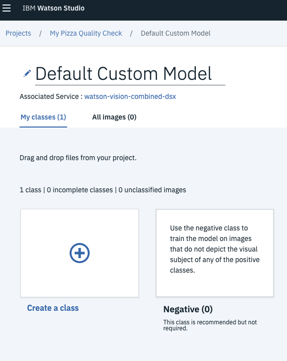
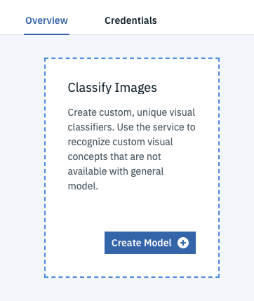
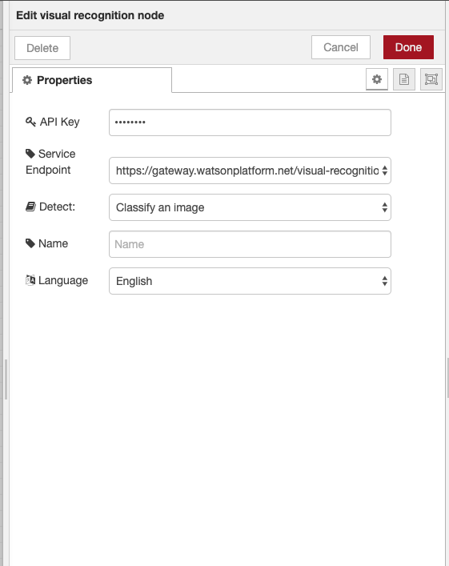

# 3.3 Lab Watson - Watson Visual Recognition - Introduction

Watson Visual Recognition understands an image’s content out-of-the-box. The pre-trained models enable you to analyze images for objects, faces, colors, food, explicit content and other subjects for insights into your visual content.

Watson can also learn any new object, person, or attribute.

With only a few images, the computer vision service can learn any new object, person, or attribute such as identifying car type and damage to estimate repair costs. Train models effortlessly with Watson Studio — a free workspace where you can seamlessly create, evaluate, and manage your custom models.

In this lab, you go through a step-by-step process to use Watson Visual Recognition out-of-the-box and then you will create your own custom model using the integrated tooling available on IBM Cloud.

# Objective

In the following lab, you will learn:

+ How to use the Watson Visual Recognition API
+ How to use the Watson Studio tools to create your own custom model
+ Integrate the service in a web app

# Pre-Requisites

+ Get an [IBM Cloud Platform account] in the US region (https://cllebrun.github.io/labs/0_Registration/), or use an existing account.

# Steps

1. Using Visual Recognition pre-trained models with the UI
2. Creating a custom classifier with the UI
3. Integrate Visual Recognition in your application with Node-Red

# Step 1 - Using Visual Recognition pre-trained models with the UI

The first part of this lab will show you how to create a Visual Recognition Service, and use its tooling to test Watson provided models.

1. Login to IBM Cloud. https://cloud.ibm.com/login

2. Go to the IBM Cloud **Catalog** and select AI category.

 

3. Then click the **Watson Studio** tile, then choose a name for your service (e.g. Watson Studio-pizza), in the **DALLAS** region, then click the Create button.

 
Watson Studio is the tool for building AI models in a collaborative fashion so you can provide a more democratic training process that reduces AI biases.

4. Click the Get Started button to open Watson Studio.
5. Click the Get Started button when prompt.

6. Click **Create a project**.
   
7. Select **Visual Recognition** type of project.
   

8. Select the **US South** region.
   

9. Enter a name for your project (e.g. My Pizza Quality Check) and a description if you like then click the **Create** button. This project will create a Watson Visual Recognition service and the needed Cloud Object Storage.
   

   Great! You have created a new machine learning project that you can collaborate on with others, upload data-sets, and create training models. Additionally, this project wizard has instantiated the Watson Visual Recognition service that is pre-trained on millions of consumer oriented images and can be used with no additional training (as we'll see below).

   However, since consumer data represents only 20% of the world's data, we will create a custom model below to teach Watson your business and what insights are in your images that consumer trained visual recognition software just doesn't cover.

**Test the General model:**

Before creating a custom model, let's check out the General model and the Food model that IBM has already trained on millions of images.

10. Click the **watson-visual-combined-dsx** link for the Watson Visual Recognition service that was automatically created for you.
   

11. Click the Test button of the General model panel.

12. Click the Test tab of this model to upload an unlabeled image that Watson will examine to determine what insights can be gleaned from Watson's training of millions of images.
  

13. Locate your favorite image search tool to find test images, use your personal images or drag images from [Test images folder](https://github.com/cllebrun/cllebrun.github.io/tree/master/labs/3.3%20Lab%20Watson%20-%20Watson%20Visual%20Recognition/Lab1%20-%20Test%20Images)
  

Notice it displays the confidence score (which is the statistical probability of this classification against other classifiers in this model).

**Test the Face model:**

Now let's explore the Faces model.

14. Click the watson-vision-combined-dsx link to return to the model choices.

15. Click the Test button of the Faces model.

16. Click the Test tab of this model then drag images from [Test images folder](https://github.com/cllebrun/cllebrun.github.io/tree/master/labs/3.3%20Lab%20Watson%20-%20Watson%20Visual%20Recognition/Lab1%20-%20Test%20Images) on the canvas.

As you can see, the Faces model not only detect the number of persons, but also the gender and an estimate of the age. It also locates the position of each faces on the picture.

Out of the box, Watson can tell you what kind of objects are in a photo even though these are your private photos that have not been indexed by a search engine nor contain labeled tags that tell Watson what the photo is about -- instead Watson can deduce this by comparing your photo against the millions of labeled photos that Watson has been trained on.

Yet still, these millions of photos are a drop in the bucket compared to how many photos are in the world and only come from the small 20% of consumer facing data, which leaves 80% of data behind your firewall -- and inside this data is your companies competitive edge.

Therefore, let's examine how easy it is to teach Watson something that consumer oriented AI doesn't do.

# Step 2 - Creating a custom classifier with the UI

Objectives : Teaching Watson New Tricks

The Visual Recognition service is trained by providing example images for each classification bucket -- the more examples you provide, the better the accuracy. After Watson has trained itself on your images, then it will classify a new image that it has never seen before and calculate how confident it is that it belongs to one of your classification types.

**Train your custom model:**

1. Once again click the **watson_vision_combined-dsx** service link to return to the model choices.

2. Click on the **Create Model** button on the Classify Images tile.
  

3. Rename your model "Default Custom Model" by "PizzaConditionModel"

4. You will now load images create your model classes. The pane to manage file upload is shown on the right side of your screen.
Click the Browse button to upload a zip file containing at least 10 photos (.jpg or .png) for good pizzas, at least 10 photos for bad pizzas, and 10 photos for not-pizzas. You can also drag and drop from your file explorer good_pizza_images.zip, bad_pizza_images.zip and not_pizza_images.zip in the [Lab 2 - Training Set folder](https://github.com/cllebrun/cllebrun.github.io/tree/master/labs/3.3%20Lab%20Watson%20-%20Watson%20Visual%20Recognition/Lab2%20-%20Training%20Set).

  

5. Create 2 classes by clicking on the + sign : GoodConditionPizza and BadConditionPizza
6. Then drag the "good_pizza_images.zip" data set from the right of the screen to the GoodConditionPizza class card. Upon completion you will see image thumbnails for the class displayed in the tile. Then drag and drop the "bad_pizza_images.zip" data set to the BadConditionPizza class card. Drop the "not_pizza_images.zip" data set classifier to the Negative (recommended) card to specify images which are not from the defined classes.
  

7. Your model is ready to train, you can now click on the "Train Model" button and for your model to be trained. Even though it might seem like Watson is taking a long time, Watson set a world record for the fastest training of 7.5 million images in 7 hours versus the previous record taking 10 days (i.e. 34 times faster): http://fortune.com/2017/08/08/ibm-deep-learning-breakthrough/

This is really powerful! You can train Watson so it recognizes what you want, even if the most obvious object in a picture isn't what you want. Let's say you are in the tire business; most image recognition software (Watson included) will recognize an automobile image instead of the tires that you care about. Building your custom model will allow you to create a domain specific image recognition service.

**Test your custom model:**

Now that Watson has been trained on your specific images, let's test it out using the toolkit.

8. Click the watson_vision_combined-dsx link to return to the Visual Recognition service and scroll down until you see your newly trained PizzaConditionModel model.
9. Click the Test button, which will take you to your Overview tab showing you information about this model.

  

10. Click the Test tab and drop some pizza images onto the canvas to see how your custom model performs. Tip: you'll find a folder named [Lab 2 - Test images](https://github.com/cllebrun/cllebrun.github.io/tree/master/labs/3.3%20Lab%20Watson%20-%20Watson%20Visual%20Recognition/Lab2%20-%20Test%20images) that contains some test images you can use; or find some from your favorite search engine.

    

# Step 3 - Integrate Visual Recognition in your application with Node-Red

**Introduction**

Node-RED is a visual tool for wiring the Internet of Things. It is easy to connect devices, data and api’s (services). It can also be used for other types of applications to quickly assemble flows of services. Node-RED is available as open source and has been implemented by the IBM Emerging Technology organization. Node-RED provides a browser-based flow editor that makes it easy to wire together flows using the wide range of nodes in the palette. Flows can be then deployed to the runtime in a single-click. While Node-Red is based on Node.js, JavaScript functions can be created within the editor using a rich text editor. A built-in library allows you to save useful functions, templates or flows for re-use.

Node-RED is included in the Node-RED starter application in IBM Cloud (IBM Cloud is IBM’s Platform as a Service, free of charge) but you can also deploy it as a stand alone Node.js application. Node-RED can not only be used for IoT applications, but it is a generic event-processing engine. For example, you can use it to listen to events from http, websockets, tcp, Twitter (and more!) and store this data in databases without having to program much, if at all. You can also use it to implement simple REST APIs. You can find many other sample flows on the Node-RED website.

In this labs, we focus on applications which make use of IBM Watson Visual Recognition capabilities.

Nodes are blocks that represent components of a larger system, in Node-RED's case usually the devices, software platforms and web services that are to be connected. Further blocks can be placed in between these components to represent software functions that wrangle and transform the data in transit.

**Deploy Node-RED on IBM Cloud**

1. Go back to the IBM Cloud console and go to the Catalog. Search for 'Node-RED', which can be found under Starter Kits:
  

2. Select "Node-RED Starter" to create it. Enter an app name, which must be unique i.e. VisualRecognitionWS-[your_lastname]. Choose Dallas as Region. Make sure one organization and one space are selected, it can be the default one. Click Create.

  

3. When your app is started, click on the "Visit app URL" link to launch your app:

  

4. Click Next, you can secure your app (which is a code editor) with a login/password, this is recommended. Click Next, next, finish.

5. Launch Node-RED by clicking on the "Go to your Node-RED editor" button. Login if needed.

**Create a simple flow with Visual Recognition**

6. Drag and drop the nodes **Inject**, **visual recognition** and **debug** on your Node-RED workspace. Wire them together.

  

7. You need to configure the **visual recognition** node. Double click on it to open it, you need an **API Key** and to select the right **endpoint url**.

You can find these credentials from Visual Recognition Service created in Step 1:

- go to https://dataplatform.ibm.com/data/services?target=watson
- click on you visual recognition instance (watson-vision-combined-dsx)
- click on Credentials tab and View credentials
- copy the apikey value

8. In Node-RED, paste the API Key value in the API Key field in your node.

9. Select https://gateway.watsonplatform.net/visual-recognition/api from the dropdown next to Service Endpoint. Click Done.

  

10. Open the **Inject** node and give an image URL as a string input: https://watson-visual-recognition-duo-dev.ng.bluemix.net/images/classify/small/computer_chip.jpg
Click Done.

  

11. Open the **Debug** node, and select "complete msg object" as output. Click Done.

  

12. Deploy your flow by clicking on the red button on your Node-RED workspace (up and right).

  

13. Click on the square next to the inject node. By doing so, it will set the payload part of the msg object as the image URL we want to send to Visual Recognition

    Node-RED is based on a msg object that "flows" from one node to another.
    - Each node can use all the msg object, or subpart of it to do its processing.
    - Each node must send back the msg object with updated content, or a new content.
    - The "main" part of the msg object is the msg.payload part
    - Watson Visual Recognition is loading the image from the msg.payload URL, and classifying the image with the specified classifier (here the default classifier)
    - Watson Visual Recognition node return its results in the msg.result object.
    - Debug node displays the msg object in the debug tab

14. Expand the msg object to discover the datastructure of msg.result

    You can see, it is the same as what we have seen in the previous lab, using the APIs.

    

**Create a flow using your custom model**

In this part, we will discover how to set the parameters of the Visual Recognition node

We will use the **Change** node to define some part of the msg object that will be used by Visual Recognition node.

  

- msg.params["detect_mode"] : A setting of "classify" or "faces" indicating the visual recognition feature required. "Default" is "classify" (string) (Optional)
- msg.params["classifier_ids"] : A comma-separated list of the classifier IDs used to classify the images. "Default" is the classifier_id of the built-in classifier. (string) (Optional)
- msg.params["owners"] : A comma-separated list with the value(s) "IBM" and/or "me" to specify which classifiers to run. (string) (Optional)
- msg.params["threshold"] : A floating value (in string format) that specifies the minimum score a class must have to be displayed in the response (Optional)
- msg.params["accept_language"] : Specifies the language of the output class names. Can be 'en' (English as default), 'es' (Spanish), 'ar' (Arabic) or 'ja' (Japanese). Classes for which no translation is available are omitted. If specified, it overrides the language specified in the node configuration (Optional)

15. To start, we will create a new page in the Node-RED UI. Click on + near the info tab, to create a new page. It will create a Flow 2 tab with an empty canvas

 

16. Insert on the canvas a **inject** node, a **change** node, a **visual recognition** node and a **debug** node like the following diagram

 

17. Configure the **visual recognition** node and the **debug** node the same way than for the Flow1.

18. With the change node, set msg.params["classifier_ids"] to your own classifier id (copied from Watson Studio):

 

  

19. Click Done.
20. In the **inject** node, add a "Good Pizza" url : http://www.delonghi.com/Global/recipes/multifry/pizza_fresca.jpg (change the name of the node for better understanding of the flow)

  
21. Add another **inject** node, add a "Bad Pizza" ur : http://aws-cf.imdoc.fr/prod/photos/3/8/1/10732381/23441387/img-23441387c2a.jpg (change the name of the node for better understanding of the flow)

  

22. Wire the nodes together and Deploy (red button up and right). You can now test the two inputs:

  

  ** Challenge: Create a flow with multiple Visual Recognition models**

Usually, classification if a multistep process. First you use a generic classification model. If the generic classifier identify something of interest, then you can apply a specific classifier.

In this step, you will have to create your own flow. This flow will first check if there is a pizza on the picture. If yes, it will check if the pizza is in good condition or not.

Before starting, it is better to click on + near the info tab, to create a new page, and start in Flow 3 empty canvas.

Hint :
- You probably need to use a function node to evaluate the result of the generic classifier.
- You need to use the **generic** model first and then your custom one!

Here is a sample of code configuration for such a node :

  
