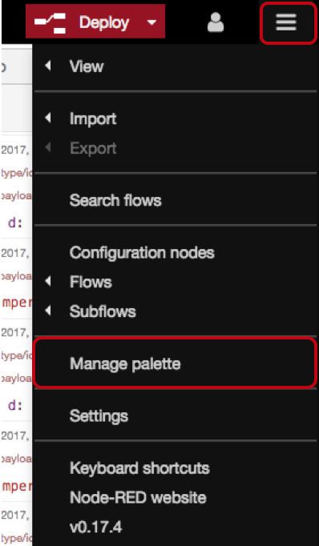
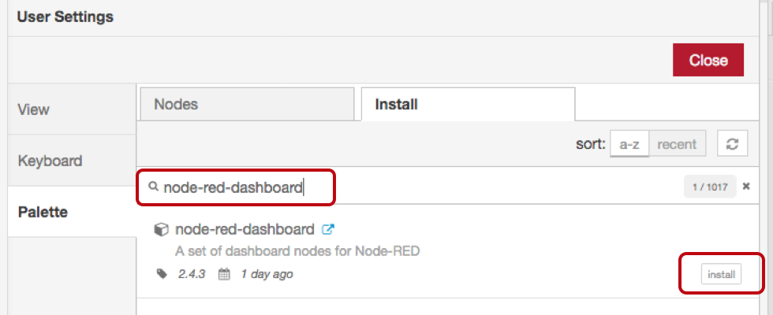
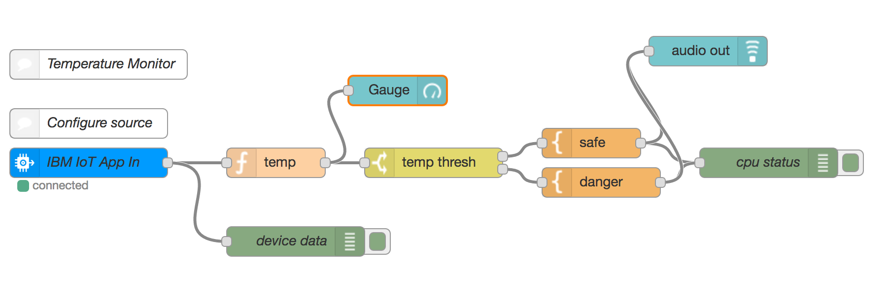
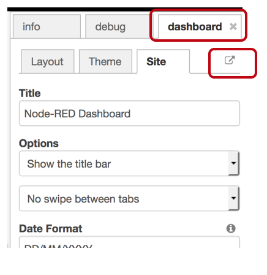

# 4.2 Lab IoT - Dashboard Nodes - Introduction

With Node-RED you have access to a large set of nodes librairies. You will learn here how to use the Node-RED dashboard nodes.

# Pre-Requisites

+ Complete the Lab 4.1

# Import the libraries

1. In Node-RED, up and right, click on the hamburger menu and select "manage palette"
 

2. Look for "node-red-dashboard" and install it

3. New nodes appear on the palette, chose the "gauge" one and the "audio out" one and add it jto the flow: 

    

4. Deploy. You can notice a new tab next to the dashboard tab. It is your dashboard management. 
5. You can open the dashboard in your browser :

    

