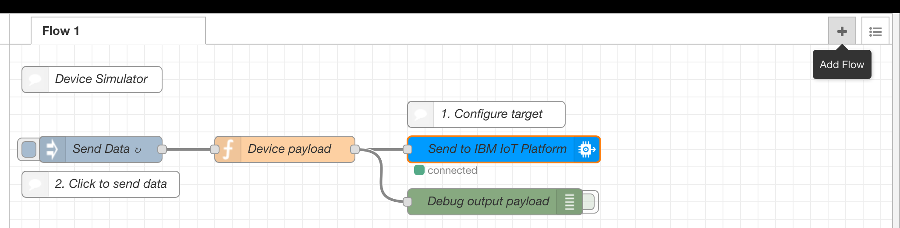
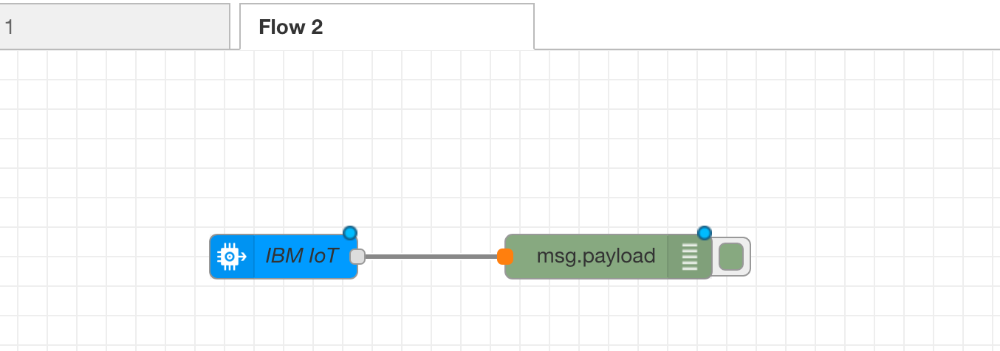
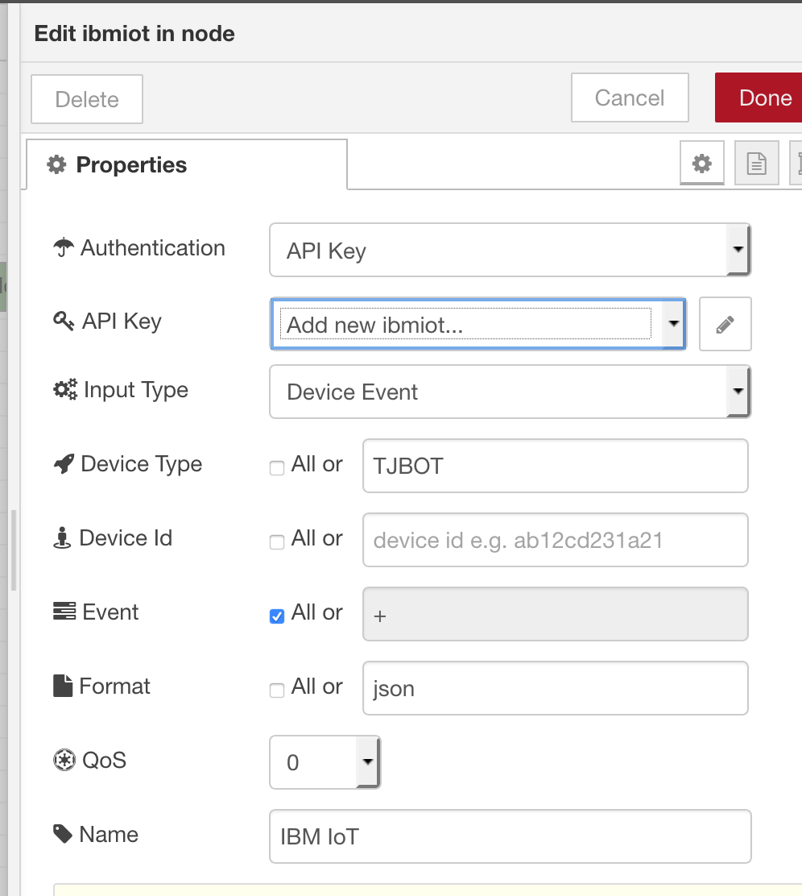

# 3.1 Lab IoT - Dashboard Nodes - Introduction

In this lab you are going to connect to a real device and use the data you collect from your real sensors.

# Pre-Requisites

+ Complete the Lab 3.0

# Connect

1. On your Node-red app, add a new Flow to your workspace (click one the "+" at the top right of your workspace)

    

2. Drag and drop an **ibmiot** and a **Debug** nodes from your palette. Wire them together.

    

3. You are going to connect to the a specific IoT platform organisation: The one where the TJBOT is sending his senseHat data. Double click on the IoT node to configure it:

    - Authentication: API Key
    - Device type: TJBOT

    

4. Click on the pen next the "Add new ibmiot" to enter an AKY KEY/Token provided by the instructor

5. Deploy and look at the results in the **Debug** tab
